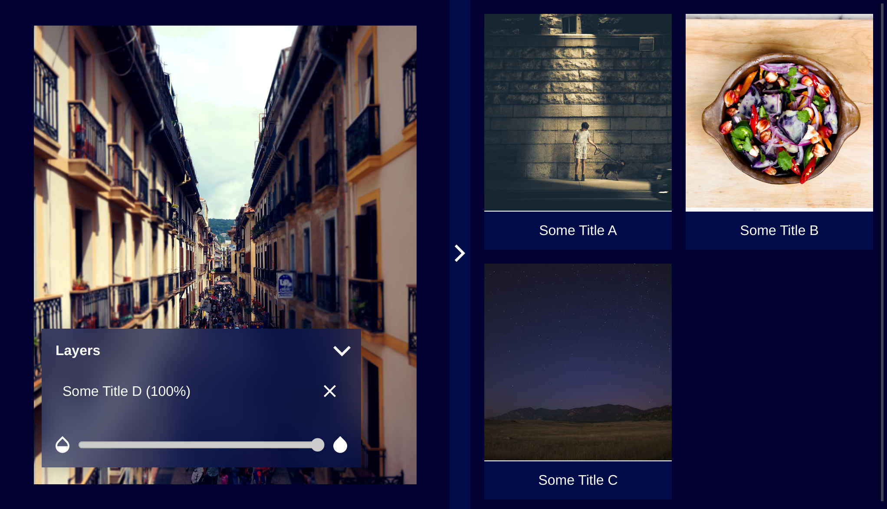
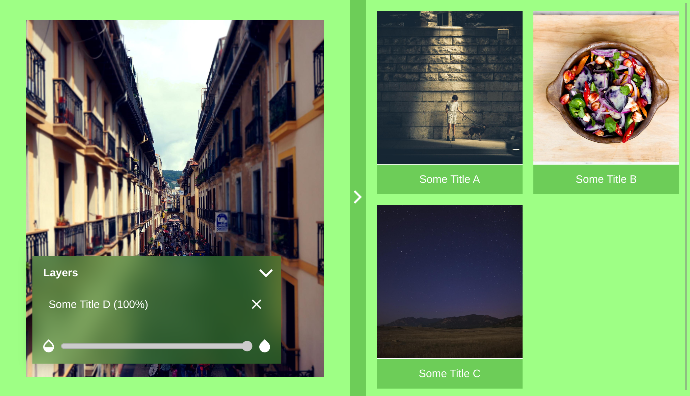
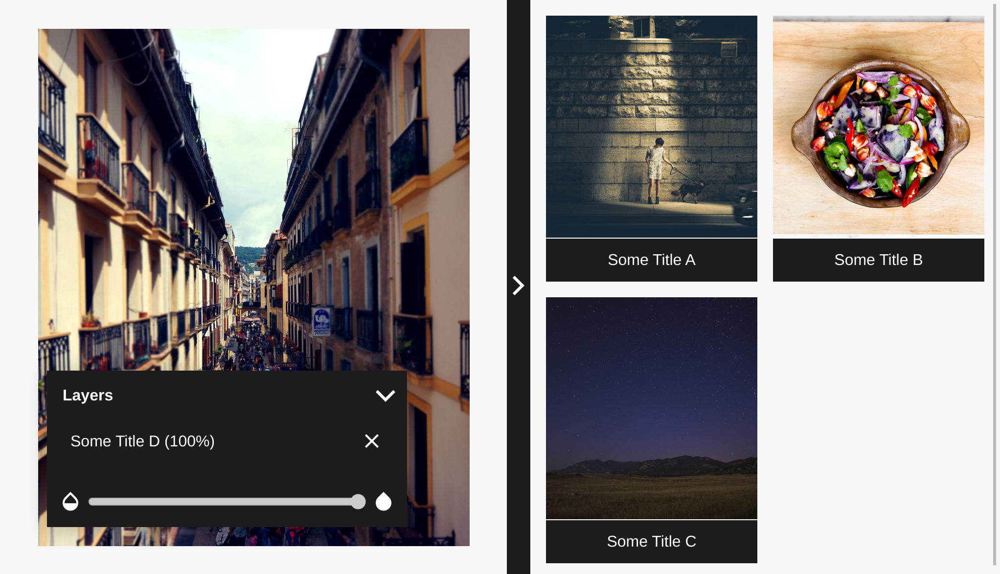
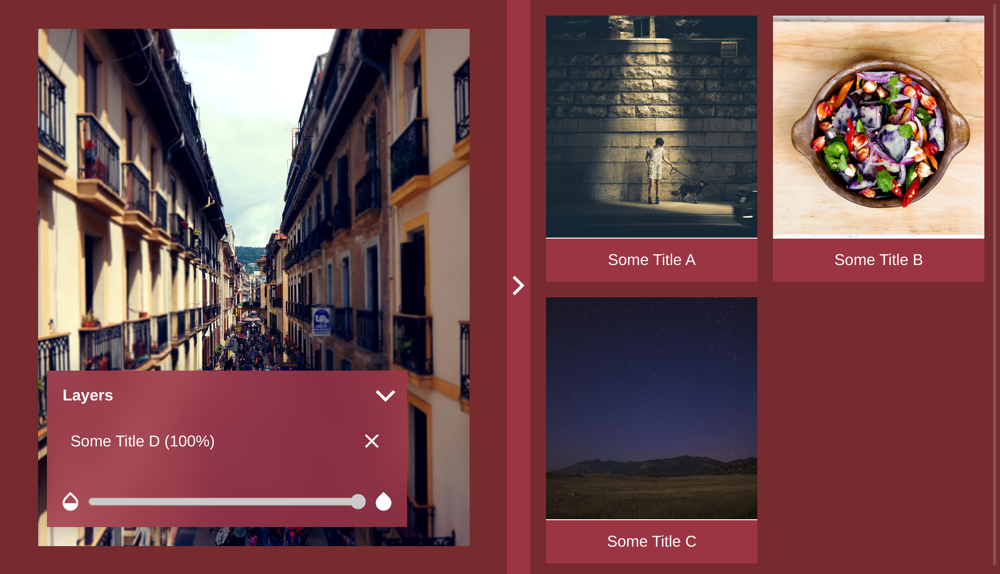

# cross-fade-viewer (Vue Component)

The Cross Fade Viewer Vue Component is an interactive image tool based on [OpenSeaDragon](https://openseadragon.github.io/) and [Vue](https://vuejs.org/), which allows users to choose images from a gallery and change their opacity in an overlayed view.

## Prerequisites
To be able to use the component in your own project you need to have a [Vue](https://vuejs.org/)-Application set up, where you can import it.
This requires the [Vue.js](https://awesomejs.dev/for/vue/pkg/245043713989935618/) library as a dependency.

## Installation

Install the package in your Vue project directory.

```
npm install @cross-fade-viewer/vue-component
```

Import the component in the ``.vue`` file where you want to use it.

```js
import CrossFadeViewer from '@cross-fade-viewer/vue-component';
```

Add the viewer by referencing its tag name in the template area of your ``.vue`` file.
```html
<template>
  <cross-fade-viewer \>
</template>
```

Configure
You can configure the component by setting the respective attributes.
```html
<crossfade-image-viewer 
  :availableImages="[{...}]"
  :displayedImages="[{...}]"
  :themeName="themeName"
  :integratedGallery="true|false"
/>
```

Notice, that ``availableImages`` and ``displayedImages`` are both arrays of images. See this sample to understand the object structure.
```js
[
  {
    title: String, // "Some Title"
    sourceUrl: String, // "https://someurl.com/image.png"
    opacity: Number // 1 = 100% visible
  },
  ...
]
```

## Themes

You can choose between 5 different color schemes. Take a look at the screenshots below to decide which one fits your needs best. 

### base
A dark color scheme used as a basic theme.

### cool
A dark blue theme.


### joyful
A bright green theme.


### nice
A bright (mainly white) theme.

### pastel
A red theme.



